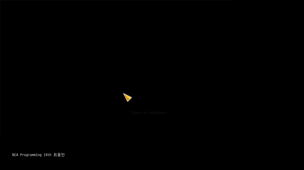
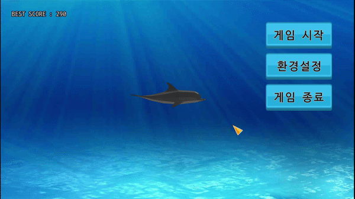
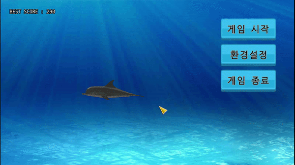
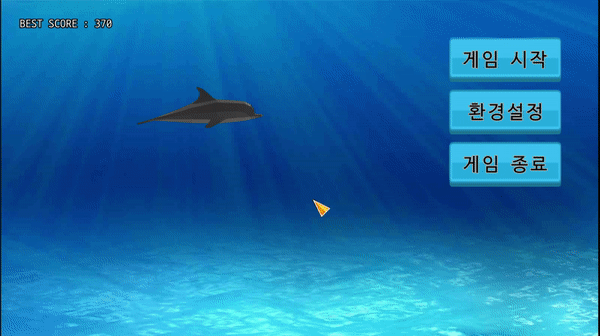
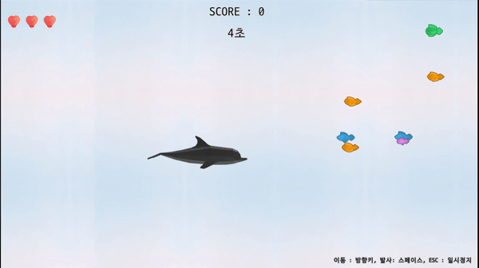
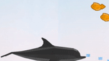
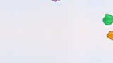
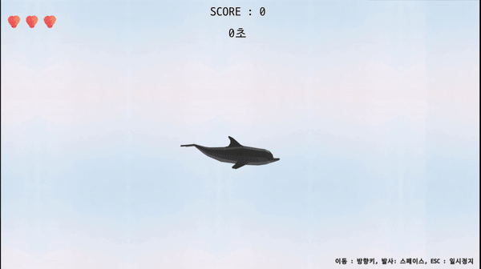
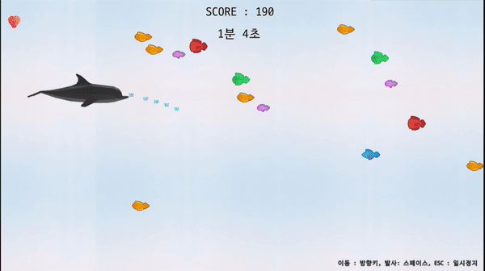

# 2D 슈팅게임 소개

## __1. 개요__

- 플레이어(돌고래)가 적(물고기)를 헤처나가며 고득점을 기록하는 슈팅 게임입니다.
- C/C++ Win32 게임 개발 강의를 8주간 수강한 후, 4주간의 개발 기간을 가졌습니다.
- Eclipse,MinGW32(gcc/g++ 6.3.0)에서 VisualStudio 2017(MSVC++ 14)로 개발환경을 변경하였습니다.

### __개발 기간 (2019.03.25 ~ 2019.04.19)__

- 개발 도구 : Eclipse, g++ 6.3.0, Win32 API, OpenGL

### __기능 개선 (2019.07.11 ~ 2019.07.26)__

- Visual Studio 2017으로 개발환경 변경, Windows SDK Version 10.0.17763.0
- OpenGL 3.2, GLSL 1.5 적용
- 피격 효과 등 기능 보완

### __프로젝트 구성__

> `MyGame/windows/` : 프로그램의 시작점인 winMain 함수를 가진 `main.cpp`와 `main.h`, `glew.c` 가 있습니다.  
> `MyGame/game/` : 게임 로직을 구현한 코드가 위치한 폴더입니다.  
> `MyGame/lib/` : 게임 개발에 사용된 소스 코드가 위치한 폴더입니다.  
> `MyGame/assets/` : 게임에 사용된 리소스들이 위치한 폴더입니다.  

_git에서 `lib` 폴더의 소스파일과 `assets` 폴더의 리소스들은 업로드하지 않았습니다._

<br><br>

---

<br>

## __2. 게임 기능__

### 1) 인트로

#### # 게임 실행 시 인트로 화면이 나타나고, 화면을 클릭하여 메뉴로 진입합니다.

||
|:--:| 
|(Fig. 1) 인트로에서 클릭 후 메뉴로 진입|

```cpp
// MyGame/game/Intro.cpp

static bool once = true;

...

void keyIntro(iKeyState stat, iPoint point)
{
    // 화면을 클릭시에 딸깍 소리와 함께 로딩 과정을 거처 메뉴 전환된다.
    if(once && stat == iKeyStateBegan)
    {
        once = false;
        audioPlay(snd_introClick);
        setLoading(gs_menu, freeIntro, loadMenu);
    }
}

```

1. 마우스 이벤트가 `windows/main.cpp`의 `윈도우 메시지 처리함수(WndProc)`에서 마우스 이벤트를 감지하여 `game/Game.cpp`의 `keyGame` 함수로 전달합니다.
2. 인트로가 실행되는 동안 `keyGame` 함수는 `keyIntro`로 마우스 이벤트를 전달합니다.
3. `keyIntro` 함수에서 클릭 이벤트를 감지하면 `Loading.cpp`의 `setLoading`를 호출하여 인트로에서 메뉴로 전환이 되도록 합니다.
4. 이 때 `once` 변수를 사용하여 인트로에서 `setLoading` 중복되어 호출되는 것을 방지하였습니다.

<br>

```cpp
// MyGame/game/Loading.cpp

void drawLoading(float dt)
{
    ...

    // 백 버퍼 크기가 1600x900으로 약 64x64크기의 랜덤한 색상을 가지는 타일들이 화면에 나타난다.
    for(int j = 0 ; j < 14 ; j++)
    {   
        for(int i = 0 ; i < 25; i++)    
        {
            setRGBA(random()%256/255.f, random()%256/255.f, random()%256/255.f, alpha);
            fillRect(64*i, 64*j, 64, 64, 4);
        }
    }

    ...
}
```

- 로딩 시 매 프레임마다 화면을 24x14개의 블럭으로 나누어 랜덤한 색으로 채워 모자이크 효과가 나도록 하였습니다.

<br><br>

### 2) 게임 메뉴

#### # 메뉴에서는 게임 시작, 환경 설정, 게임 종료가 가능합니다.

#### # 최고 득점을 확인할 수 있고, 마우스를 클릭한 좌표로 돌고래가 이동합니다.

<br>

||
|:-:|
|(Fig. 2) 메뉴에서 돌고래가 마우스를 클릭한 위치로 이동하는 모습|

```cpp
// MyGame/game/Menu.cpp

iPoint movePoint;

void draw(float dt)
{
    ...
    
    // 메뉴에서 클릭한 좌표를 넘겨주어 이동하도록 한다.
    player->paint(dt, movePoint);
    
    ...
}

void keyMenu(iKeyState stat, iPoint point)
{
    // 키를 입력한 곳으로 이미지를 좌우 반전 시키고, 클릭한 좌표를 저장해둔다.
    if (stat == iKeyStateBegan)
    {
        player->setImgReverse(point);
        movePoint = point;
    }

    ...
}
```

```cpp
// MyGame/game/Player.cpp

void Player::setImgReverse(iPoint point)
{
    // 플레이어 이미지의 중심을 시작점으로, 넘겨 받은 좌표를 도착점으로 설정한다.
    iPoint off = iPointMake(size.width / 2, size.height / 2);
    iPoint sp = img->position + off;
    iPoint ep = point;

    // 플레이어 이미지는 오른쪽을 바라보고 있다.
    // 플레이어가 향하는 방향이 화면의 왼쪽을 향하면 이미지를 반전 시켜 왼쪽으로 바라보게 한다.
    img->leftRight = ((ep.x - sp.x) < 0);
}

void Player::paint(float dt, iPoint point)
{
    if (gameState == gs_proc)
    {
        // 플레이 화면에서 동작
        ...
    }
    else
    {
        // 메뉴 화면에서 동작
        iPoint v = point - (img->position + iPointMake(size.width / 2, size.height / 2));
        img->position += v * dt;

        img->paint(dt);
    }

    ...
}
```

1. `keyMenu` 함수에서 클릭 한 방향으로 돌고래 이미지가 바라보도록 하고, 클릭한 좌표를 `movePoint`에 저장합니다.
2. `drawMenu` 함수에서 `player::paint` 함수가 호출되어 경과한 시간만큼 해당 좌표로 이동합니다.

<br>

#### # 메뉴 각 버튼별 작동 모습

||
|:-:|
|(Fig. 3)메뉴에서 게임 시작 버튼을 클릭하여 게임 시작|

<br>

|
|:-:|
|(Fig. 4)메뉴에서 환경설정을 선택하여 볼륨을 조절|

<br>

||
|:-:|
|(Fig. 5)메뉴에서 게임 종료를 선택하여 사용자 확인 후 종료|

<br><br>

### 3) 게임 플레이

#### # 게임이 시작되면 약 3초간 플레이어(돌고래)가 화면 왼쪽에서 오른쪽으로 이동하여 등장합니다. (Fig. 3)

#### # 플레이어 조작은 키보드 방향키로 이동하고 Space Bar로 로 발사체를 생성합니다.

||<br><br><br>|
|:-:|:-:|
|(Fig. 6) 플레이 화면|(Fig. 7) 피격 효과|

```cpp
// Proc.cpp

...

void drawProc(float dt)
{
    ...
    // 게임 시작 후 3초동안 플레이어를 화면 왼편에서 화면의 3/8 지점으로 이동시킨다.
    if(procStartTime < 3.0f)
    {
        float x = linear(procStartTime/3.0f, -devSize.width/2, devSize.width*3/8);
        player->position = iPointMake(x, devSize.height/2);

        // 시간에 따라 오디오의 피치를 0 ~ 3으로 재생
        audioPitch(snd_inGame, procStartTime);
        procStartTime += dt;
        dt = 0.0f;
        if (procStartTime >= 3.0f)
        {
            // 3초가 지나면 게임이 진행될 수 있도록 함.
            player->img->intervalDt = 0.1f;
            audioPlay(snd_inGame);
            audioPitch(snd_inGame, 1.0f);
            bGenEnemy = true;
        }
    }

    ...
}
```

```cpp
// MyGame/game/Player.cpp

void Player::paint(float dt, iPoint off)
{
    if (gameState == gs_proc)
    {
        // 사용자 입력 처리
        update(dt, off);

        iPoint p = off + player->position;
        img->paint(dt, p);

        // 피격 효과
        if (damageTime < _damageTime)
        {
            float r = damageTime / _damageTime;
            damageTime += dt;

            // 빨간색에 투명도를 적용하여 기존 이미지를 이용하여 덧그린다.
            setRGBA(1, 0, 0, fabs(_sin(360 * r)));
            drawImage(img->tex, p.x, p.y, TOP | LEFT);
            setRGBA(1, 1, 1, 1);
        }
    }
    ...
}

void Player::update(float dt, iPoint off)
{
    iPoint v = moveVector;

    // 키를 떼었을 때 흐른 시간 만큼 감속
    float po = dt;
    if( v.x > 0 && (getKeyStat()&keyboard_right)!=keyboard_right )		{ v.x -= po; if( v.x < 0 ) v.x = 0; }
    else if( v.x < 0 && (getKeyStat()&keyboard_left)!=keyboard_left  )	{ v.x += po; if( v.x > 0 ) v.x = 0; }
    if( v.y > 0 && (getKeyStat()&keyboard_down)!=keyboard_down )		{ v.y -= po; if( v.y < 0 ) v.y = 0; }
    else if( v.y < 0 && (getKeyStat()&keyboard_up)!=keyboard_up )		{ v.y += po; if( v.y > 0 ) v.y = 0; }

    // 키를 누른 방향으로 흐른 시간의 5배 크기 만큼 가속
    po = dt*5;
    switch(getKeyStat()&15)	// getKeyStat() & (keyboard_left|keyboard_right|keyboard_up|keyboard_down) //00011111
    {
        case keyboard_left:                v.x -= po; if( v.x<-1 ) v.x = -1; break;
        case keyboard_left|keyboard_up:    v.x -= po; if( v.x<-1 ) v.x = -1; v.y -= po; if( v.y<-1 ) v.y = -1; break;
        case keyboard_left|keyboard_down:  v.x -= po; if( v.x<-1 ) v.x = -1; v.y += po; if( v.y> 1 ) v.y =  1; break;
        case keyboard_right:               v.x += po; if( v.x> 1 ) v.x =  1; break;
        case keyboard_right|keyboard_up:   v.x += po; if( v.x> 1 ) v.x =  1; v.y -= po; if( v.y<-1 ) v.y = -1; break;
        case keyboard_right|keyboard_down: v.x += po; if( v.x> 1 ) v.x =  1; v.y += po; if( v.y> 1 ) v.y =  1; break;
        case keyboard_up:                  v.y -= po; if( v.y<-1 ) v.y = -1; break;
        case keyboard_down:                v.y += po; if( v.y> 1 ) v.y =  1; break;
        default:break;
    }

    // 이동이 있을 때 맵 바운드를 벗어나는지 확인
    if(v != iPointZero)
    {
        float speedRate = iPointLength(v);

        // 최대 속도를 초과하지 않도록 한다.
        if(speedRate > speed)
            v = v*(speed/speedRate);

        position += v*(speed*dt);

        // 이동할 위치가 지정된 범위를 벗어나면 보정한 후, 이동하려는 방향의 값을 0으로 고친다.
        if (!containPoint(position, mapBound))
        {
            // Check horizontal bound
            if (position.x < mapBoundOff.x)
            {
                v.x = 0;
                position.x = mapBoundOff.x;
            }
            else if (position.x > mapBoundOff.x + mapBound.size.width)
            {
                v.x = 0;
                position.x = mapBoundOff.x + mapBound.size.width;
            }
            
            // Check vertical bound
            if (position.y < mapBoundOff.y)
            {
                v.y = 0;
                position.y = mapBoundOff.y;
            }
            else if(position.y > mapBoundOff.y + mapBound.size.height)
            {
                v.y = 0;
                position.y = mapBoundOff.y + mapBound.size.height;
            }

        }
        
        moveVector = v;
    }

    // 발사체 생성
    if( getKeyStat()&keyboard_space)
    {
        fireDelay += dt;
        while(fireDelay > _playerFireDelay)
        {
            attack();
            fireDelay -= _playerFireDelay;
        }
    }
}

void Player::attack()
{
    // 플레이어가 죽으면 발사하지 않음
    if (!alive)
        return;

    // 발사 효과음 재생
    audioPlay(snd_shoot);

    // 발사 위치를 플레이어 이미지 좌상단 position과 이미지 크기 size를 통해 머리 앞에서 발사되도록 한다.
    iPoint p = position + iPointMake(size.width, size.height/2);
    addBullet(this, 1, p, iPointMake(p.x+1, p.y), iSizeMake(16,32));
}

void Player::getDamage(int damage)
{
    // 피격시 체력이 damage만큼 차감되고 체력이 0이하가 되면 생존 flag를 false로 변경한다. 
    // 피격 효과를 활성화 하기위해 damageTime을 0.0f로 설정
	if(hp <= 0)
	{
		alive = false;
		return;
	}
	hp -= damage;

	damageTime = 0.0f;
}
```

1. `void Player::update(float dt, iPoint off)`에서 키보드 입력을 처리합니다.
2. 키 입력이 없으면 감속하고, 키 입력이 있으면 가속하는 움직임을 가집니다. (Fig. 6)
3. 플레이어가 화면 밖으로 나가지 않도록 `mapBound`를 벗어나면 이동 방향과 위치를 조정합니다.
4. 키보드 space를 누르고 있는 동안에 `attack()` 함수가 호출되어 플레이어 앞에서 발사체가 생성됩니다.
5. 플레이어나 적은 피격시 기존 이미지위에 다시 투명도가 적용된 이미지를 덧 그려서 깜빡이는 효과를 만듭니다. (Fig. 7)

<br>

#### # 게임 중 Esc 버튼을 클릭하면 일시정지 메뉴가 나타나고, 다시 Esc를 누르거나 돌아가기를 클릭하여 게임으로 게임을 재개합니다. (Fig. 9)

||
|:-:|
|(Fig. 8)일시정지 메뉴|

```cpp
// iStd.h

...

// 버튼 상태를 4가지 상태로 정의
#define iButtonStateNum 4
typedef enum _iButtonState {
    iButtonStateIdle = 0,
    iButtonStateClick,
    iButtonStateHover,
    iButtonStateDisabled,
} iButtonState;

...

```
```cpp
// MyGame/game/Proc.cpp

...

#define num_pop_pause_btn 3

// 일시정지 메뉴를 그리기 전에 호출되는 함수
void methodPopPausePaintBefore(void* parm, iPoint point, float scale, float alpha, float dt)
{
    int btnImgIdx;
    for(int btnIdx = 0 ; btnIdx < num_pop_pause_btn ; btnIdx++)
    {
        // 팝업에서 마우스가 올려지지 않은 이미지는 iButtonStateIdle 값에 해당
        btnImgIdx = (popPause->selected == btnIdx) ? iButtonStateHover : iButtonStateIdle;
        imgPauseBtn[btnIdx]->setTexAtIndex(popPause->selected == btnIdx);
    }
}

void methodPopPauseClose(void* parm)
{
    // 버튼을 눌러 닫힐 때 처리
    switch( closePopPauseOpen )
    {
        ... 

        case close_pause_open_settings:
        {
            // 게임 중 Setting을 호출 시 커서를 활성화 하도록 한다.
            updateCursorVisible(true);
            showPopSetting(true);
            break;
        }
        case close_pause_open_menu:
        {
            // 게임에서 메뉴로 전환한다.
            setLoading(gs_menu, freeProc, loadMenu);
            break;
        }
        default: break;
    }
}

#define num_pop_pause_btn 3
#define close_pause_open_game     0
#define close_pause_open_settings 1
#define close_pause_open_menu     2

int closePopPauseOpen;

bool keyPopPause(iKeyState stat, iPoint point)
{
    // 팝업이 열리는 도중에 마우스 이벤트 발생을 막고, 다른 마우스 이벤트 처리를 위해 false를 반환한다.
    if( popPause->stat != iPopupStatProc )
        return false;

    switch( stat )
    {
        case iKeyStateBegan:
        {
            if(popPause->selected == -1)
                break;

            // 팝업이 닫힐 때 동작을 처리하도록 선택된 버튼 정보를 저장합니다.
            closePopPauseOpen = popPause->selected;
            showPopPause(false);
            break;
        }
        case iKeyStateMoved:
        {
            // 팝업에 마우스 커서가 올라간 버튼 정보를 저장한다.
            int btnIdx, prevBtnIdx = -1;
            for(btnIdx = 0 ; btnIdx < num_pop_pause_btn ; btnIdx++)
            {
                if(containPoint(point, imgPauseBtn[btnIdx]->touchRect(popPause->closePoint)))
                {
                    prevBtnIdx = btnIdx;
                    break;
                }
            }
            popPause->selected = prevBtnIdx;
            break;
        }

        ...

    }

    return true;
}

void showPopPause(bool show)
{
    // 일시정지 메뉴를 활성화에 따라서 커서도 활성/비활성 상태로 만든다.
    popPause->show(show);
    updateCursorVisible(show);
}

```

1. 게임 실행 중에 키보드 esc를 눌러서 일시 정지 메뉴를 활성화 합니다.
2. 게임이 실행되는 동안에는 마우스 커서가 그려지지 않습니다. 그래서 버튼을 선택해서 처리해야하는<br>
팝업 화면이 활성화되면 마우스 커서를 나타나도록 하고, 닫힐 때 마우스를 비활성화 하도록 하였습니다.

<br>

#### # 물고기와 부딪히면 플레이어의 체력이 1 감소합니다.
#### # 체력이(좌상단 하트) 0이되면 게임이 끝나고, 다시 플레이하거나 메뉴로 돌아갈 수 있습니다. (Fig. 9)

||
|:-:|
|(Fig. 9)게임 오버 후 종료 모습|

```cpp
// Proc.cpp

bool keyPopResult(iKeyState stat, iPoint point)
{
   ...

    switch (stat)
    {
        case iKeyStateBegan:
        {
            if (popResult->selected == 0)   
                setLoading(gs_menu, freeProc, loadMenu);    // 나가기 버튼을 선택시 메뉴로 전환
            else                            
                setLoading(gs_proc, freeProc, loadProc);    // 한 번 더 버튼을 선택시 게임을 다시 로딩

            break;
        }
        
        ...
    }

    return true;
}
```

* `나가기` 버튼과 `한 번 더` 버튼을 클릭 시 메뉴를 로딩하거나 다시 게임을 로딩합니다.

---